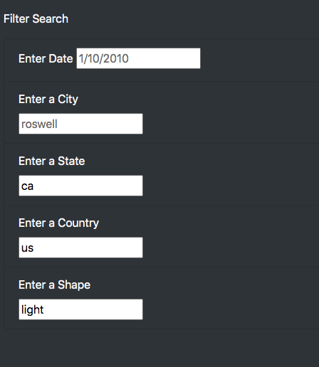
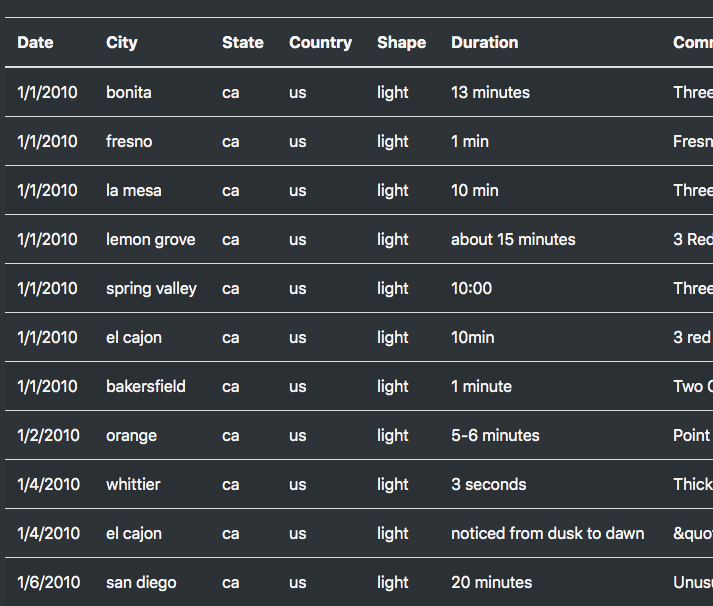

# UFOs

## Overview of Project
### *Purpose*
The purpose of this analysis is to showcase the research result done by far about Unidentified Flying Objects. The analysis includes an introduction to the community that's supporting the research of the UFO sightings project. Data is displayed in a table with UFO sighting records. The table of the data has columns of Date, City, State, Country, Shape, Duration, and Comments on each record. A search filter is built on the webpage to help readers sort out the information as needed.

It's our job to lay out the discoveries, we believe you will make good use of them and decide for your own where you stand on whether we are alone in the universe, whether the evidence is enough to prove if aliens had attempted to contact us, whether they should be left alone.

### *Tools*
This analysis uses JavaScript, HTML, and CSS to implement the data representation on a webpage. Bootstrap and jumbotron are two of the libraries used to make the styling of the webpage easier and prettier.

 

## Results
 

### *The Webpage*
As mentioned in the overview section, this webpage has provided information for readers and it has different segments to make it user-friendly. Here are all the segments designed for this webpage:
 * Navigation Bar (UFO Sightings)

 * Page Header (The Truth Is Out There)
 * Article Title (UFO sightings: Fact or Fancy? Ufologists Weigh In)
 * Article Paragraph (the paragraph to the right of the title with a brief introduction of the research)
 * Filters for the Table (filter search with 5 filters to be applied)
 * Table of Sighting Data (table of data records)

 

### *The Search Criteria*

The filter search can be used to modify the data records displayed in the table beside it.

Here are some simple steps to follow:
* Step 1: Determine the filter criteria for your search

* Step 2: Type in the criteria based on your need following the example input in the blank input box (e.g.search for the shape that's "light", the country being "us", and state being "ca"). The new input criteria will show up as black, whereas the example input will remain grey.

    

* Step 3: When you finished all the input on the search criteria, simply click anywhere else on the webpage

* Step 4: The records matching your search criteria will display in the table

    

 

## Summary
 

The webpage does not have a clear way of indicating whether the filter is applied or not. If there are more data records and columns, it could be hard to know whether the filter has been applied or not and therefore cause confusion during a search.

Here are two recommendations for further improvement on the webpage. One is to add a button to confirm applying the filter. Another is to add contact information on the top navigation bar in case the reader is interested in getting more inquiries answered.